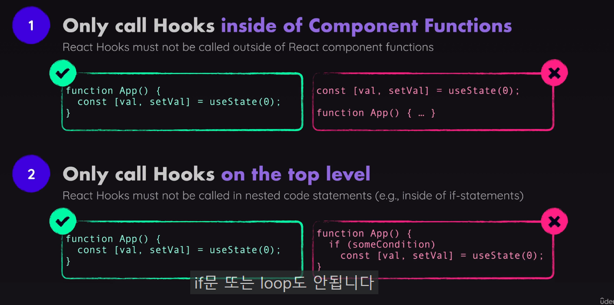

## 리액트 핵심 - 컴포넌트,JSX,속성,State
# 코드
컴포넌트화 해서 사용 + 동적 할당{`${}`}
컴포넌트화 해서 재사용이 가능
```javascript
function Header() {
  return (
    <header>
      
      <h1>React Essentials</h1>
      <p>
        {`${reactDescriptions[genRandomInt(2)]} React concepts you will need for almost any app you are going to build!`}
      </p>
    </header>
  );
}

function App() {
  return (
    <div>
      <Header />  
      <main>
        <h2>Time to get started!</h2>
      </main>
    </div>
  );
}
```
# Props 개념 사용 (컴포넌트로 데이터 전달)
map을 사용하여 중복되는 컴포넌트 처리 (미리 데이터를 받아놓던가 관리 해야 쓰기 쉬움 , key 넘겨줘야함) ... 을통하여 넘기기 가능
props를 받기

한파일에 너무 많은 컴포넌트 X componenet폴더를 통해서 관리 Css또한 다르게 관리 가능 But Scope 를 조절 잘해야함
Header.css 는 Header.jsx에 import 되어 있지만 App.jsx에 <header>를 만들어도 똑같이 적용이 되는 문제 

```Javascript
{CORE_CONCEPTS.map((concept) => <CoreConcept  {...concept} />)}
{CORE_CONCEPTS.map((concept) => <CoreConcept title={concept.title} description={concept.description} image={concept.image} />)}

function CoreConcept( {title,description,image}) {
  return (<li>
    
    <h3>{title}</h3>
    <p>{description}</p>
  </li>)
}


```

🔻 컴포넌트 사이에 값을 넣는걸 컴포넌트 합성이라 함🔻 
```javascript
    <TabButton>
        Component
    </TabButton>

export default function TabButton({children}){
    
    return (<li><button>{children}</button> </li>);
}

```
이런 방법도 가능 
```javascript
     <TabButton label="Components" /> 

export default function TabButton({label}){
    
    return (<li><button>{label}</button> </li>);
}
```


# useState 사용법에서 주의할점


# 조건문 사용
```javascript
{!value ? <p>Please select a topic</p> : <div id="tab-content"></div>
  ?를 이용하여 출력될거 선택
{value &&  <div id="tab-content"></div>}
&&도 또한 표현 방법
```
# Class 지정
class X className O


# 동적 css
조건 문을 사용하여 선택 유무 확인 가능 외우기보단 느낌으로 이해 하기
```javascript
  <TabButton isSelected={value ==="components"} onSelect={() => handleClick("components")} label="Components" />


    export default function TabButton({ label,onSelect ,isSelected}) {
    
    return(
    <li>
        <button className={isSelected ? "active" :""} onClick={onSelect} >{label}</button>
    </li>
    );
}
```