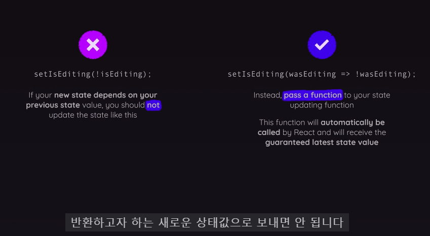

# public에 사진 넣으면 이름만으로도 참조 가능
```javascript


```

# 쫌더 짧은 코드 방법
```javascript
{isEditing ? <button onClick={onClick}>Save</button>  : <button onClick={onClick}>Edit</button>}
<button onClick={onClick}>{isEditing ? "Save" : "Edit"}</button>

setIsEditing(isEditing ? false : true)
setIsEditing(!isEditing )
```

# 주의

1번 방식은 비추천
2번이 리액트가 추천 과거값을 기준으로 현재값을 설정할때 함수를 통하여 해야함
```javascript
const onClick = () =>{
        setIsEditing(!isEditing)

    }
const onClick = () =>{
        setIsEditing((editing)=> !editing)

    }

```
# 불변하는 상태로 업데이트 한다는 것이 이해 X
```javascript
setGameTurns(prevTurns =>{
      const updatedTurns =[...prevTurns]
    })
```

# 변수 있는 함수 props로 넘겼을때 사용법
{()=>onSelectSquare(rowIndex,colIndex)} 통해서 해결
```javascript
function handleSelectSquare(rowIndex,colIndex)
<GameBoard  onSelectSquare={handleSelectSquare} turns={gameTurns}/>
<button onClick={()=>onSelectSquare(rowIndex,colIndex)}>{playerSymbol}</button>
```
# state를 관리하거나 (쓸데없는 state 즉 한곳에 관리가능한경우나 필요 없는 경우)상위 컴포넌트에서 하위컴포넌트로, 또는 그반대로 정보(props) 보내는 방법에 대해 익숙해져야 겠다.